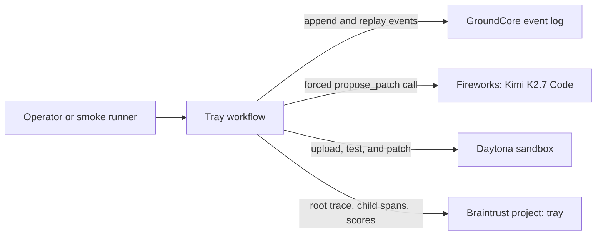

# Tray

Tray is a durable approval service for AI-generated code changes. Fireworks proposes a typed patch, Daytona executes it in an isolated sandbox, Braintrust records the trace and deterministic scores, and GroundCore records every workflow transition.

This repository implements the workflow through Step 4a: a durable event log, Daytona execution, Fireworks proposal generation, Braintrust tracing, a local HTTP approval service, restart recovery, terminal-state sandbox cleanup, and a responsive browser interface.

## Problem

An AI coding workflow can lose a pending operation when its controller restarts. If a proposal, approval state, or execution result exists only in process memory, the workflow cannot reliably resume and its actions cannot be audited afterward.

Tray persists each transition before moving to the next action. A `proposed` event contains the complete executable operation: path, previous file contents, replacement file contents, reason, and Daytona sandbox ID. Approval and execution consume the persisted proposal instead of requesting another model response.

## Architecture



## Implemented workflow

The successful path records eight ordered events:

```text
created → diagnosed → proposed → approved → applied → verified → evaluated → completed
```

`failed` records an execution error. `rejected → completed` records a rejected proposal. Without auto-approval, the headless workflow stops after `proposed` and reports `awaiting_approval`.

The apply stage does not use an in-memory proposal. It replays the `proposed` event from GroundCore, downloads the current source from Daytona, verifies it still equals the persisted `old_content`, and writes the persisted `new_content`. A mismatch produces `failed` with `source changed since proposal`.

## Integrations

### GroundCore

- The vendored `vendor/groundhog` binary reports `0.1.0+d734861b3295`.
- Events use `source=tray`, `stream=runs`, and `record_key=<run_id>`.
- Batch IDs are deterministic: `tray/<run_id>/<kind>/<attempt>`.
- Identical retries return the original receipt with `duplicate: true`.
- Replay follows `next_after` until it equals `snapshot_through_event_id`.
- The pinned binary predates server-side `record_key` replay filtering, so the client filters run IDs locally while preserving pagination.

### Daytona

- Every run creates a Python sandbox with `autoStopInterval: 0` and `autoPauseInterval: 0`.
- Fixture files move through `sandbox.fs.uploadFile` and `downloadFile`; model-generated content is never passed through a shell heredoc.
- Paths are resolved from `sandbox.getUserHomeDir()`.
- Commands have a 60-second timeout and their combined output is bounded to 4 KiB.
- Sandboxes remain active while a run awaits approval and are deleted after a terminal `completed` or `failed` event. Deletion failures are logged without changing the durable run result.
- The scripted smoke verifies a failing unittest, applies the persisted replacement, and verifies the passing unittest in the same sandbox.

### Fireworks

- The pinned serverless model is `accounts/fireworks/models/kimi-k2p7-code`.
- One OpenAI-compatible chat completion receives the task, failing unittest output, and complete `calc.py` source.
- `tool_choice` forces the `propose_patch` function and temperature is `0`.
- Returned arguments must select `calc.py` and provide non-empty complete replacement content that differs from the original.
- One invalid response is retried. A second failure uses the scripted proposer and persists `model_fallback: true`; a fallback is never represented as a model-generated patch.

### Braintrust

- One logger targets the `tray` project.
- Each workflow runs under one root `tray-run` trace correlated by `run_id` and `sandbox_id`.
- Fireworks calls are captured through `wrapOpenAI`.
- Daytona operations and GroundCore appends are child spans.
- GroundCore batch and event IDs are stored in trace metadata.
- The root trace records deterministic `tests_passed` and `patch_scope` scores.
- The root trace permalink and both scores are persisted in the `evaluated` event.

### Approval service

- `POST /api/runs` creates a Daytona sandbox, diagnoses the fixture, requests a Fireworks proposal, persists it, and stops at `awaiting_approval`.
- `GET /api/runs` and `GET /api/runs/:run_id` derive their responses by replaying GroundCore; the browser does not depend on an in-memory run registry.
- `POST /api/runs/:run_id/decision` accepts `approve` or `reject` and consumes the persisted proposal.
- `POST /api/runs/:run_id/resume` resumes an interrupted run after its approval was persisted.
- On startup, the service automatically resumes approved runs that have not reached a terminal event.
- Approval reconnects to Daytona with the persisted sandbox ID. If the controller stopped after writing the new file but before recording `applied`, recovery recognizes the exact persisted `new_content` and continues without writing a second change.
- The persisted Braintrust parent context connects post-restart approval work to the original trace.

### Browser interface

- The run list and detail view replay persisted workflow state from the HTTP API.
- Pending runs show the complete replacement, reason, failing test output, and explicit approve and reject actions.
- Completed runs show before-and-after test evidence, the eight-event ledger, deterministic scores, and the Braintrust trace link.
- The layout includes desktop run navigation, a mobile navigation dialog, operating-system dark mode, keyboard focus states, and mobile touch targets.

## Setup

Requirements:

- macOS on Apple Silicon for the vendored GroundCore binary
- Node.js and npm
- Python 3
- Daytona, Fireworks, and Braintrust API keys

Install dependencies and create the local configuration:

```sh
npm install
cp .env.example .env
```

Populate these values in `.env`:

```dotenv
DAYTONA_API_KEY=
FIREWORKS_API_KEY=
BRAINTRUST_API_KEY=
FIREWORKS_MODEL=accounts/fireworks/models/kimi-k2p7-code
GROUND_SOCK=./data/ground/data/ground.sock
TRAY_PORT=4600
```

Initialize GroundCore once, then keep the server running in a separate terminal:

```sh
mkdir -p data
vendor/groundhog init ./data/ground
vendor/groundhog serve --config ./data/ground/groundhog.toml
```

Start the development service at `http://127.0.0.1:4600`:

```sh
npm run dev
```

Build and run the production interface:

```sh
npm run build
npm start
```

## Verification commands

```sh
npm run typecheck
npm run build
npm run smoke:eventlog
npm run smoke:daytona
npm run smoke:agent
npm run cleanup
vendor/groundhog verify --chain --config ./data/ground/groundhog.toml
```

- `smoke:eventlog` verifies ordered replay and duplicate ingestion.
- `smoke:daytona` runs the full eight-event path with the scripted proposer.
- `smoke:agent` runs the full path with live Fireworks and Braintrust, requires no fallback, checks both scores are `1`, and prints the Braintrust trace URL.
- `cleanup` deletes all Daytona sandboxes in the configured account. Run it only when no workflow is awaiting approval.
- A restart recovery check can create a run with `POST /api/runs`, restart the service after `proposed`, and submit approval through `POST /api/runs/:run_id/decision`.
- To reproduce post-write recovery, start the service with `TRAY_CRASH_AFTER_WRITE=1`, approve a run, then restart without that variable. Startup recovery records one `applied` event with `recovered_after_write: true` and completes the run.

## Current limitations

- This is a prototype containing one fixed Python workflow and fixture.
- There is no HTTP authentication or multi-user authorization.
- Idempotent event ingestion does not provide exactly-once external execution.
- Daytona sandboxes have automatic stop and pause disabled while they await approval, so operators must avoid deleting a pending run's sandbox with `npm run cleanup`.
- The vendored GroundCore binary is macOS ARM64; other platforms must build GroundCore from source.

## Disclosure

GroundCore, the append-only event store vendored here as the prebuilt `groundhog` binary, is a pre-existing personal project. Everything else in this repository was built during Daytona HackSprint SF, July 24, 2026.
