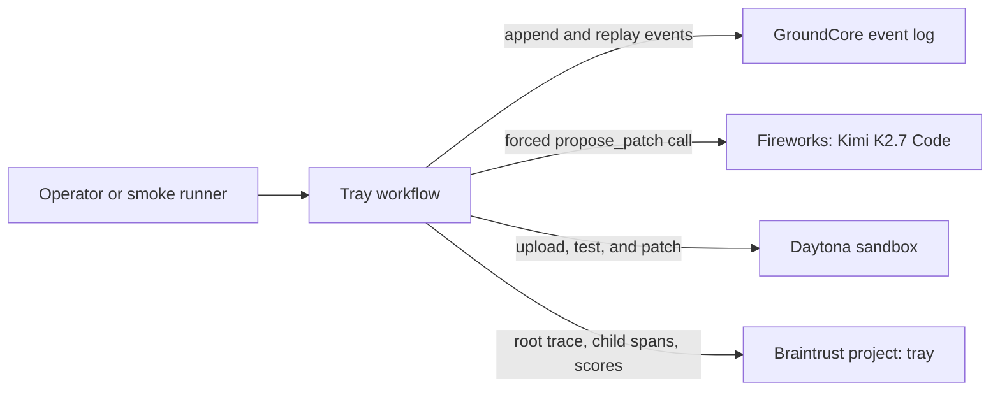

# Tray

Tray is a durable approval service for AI-generated code changes. Fireworks proposes a typed patch, Daytona executes it in an isolated sandbox, Braintrust records the trace and deterministic scores, and GroundCore records every workflow transition.

This repository currently implements the headless workflow through Step 3. The HTTP approval service, restart recovery route, and browser interface are Step 4 work and are not implemented yet.

## Problem

An AI coding workflow can lose a pending operation when its controller restarts. If a proposal, approval state, or execution result exists only in process memory, the workflow cannot reliably resume and its actions cannot be audited afterward.

Tray persists each transition before moving to the next action. A `proposed` event contains the complete executable operation: path, previous file contents, replacement file contents, reason, and Daytona sandbox ID. Approval and execution consume the persisted proposal instead of requesting another model response.

## Architecture



## Implemented workflow

The successful path records eight ordered events:

```text
created → diagnosed → proposed → approved → applied → verified → evaluated → completed
```

`failed` records an execution error. `rejected → completed` records a rejected proposal. Without auto-approval, the headless workflow stops after `proposed` and reports `awaiting_approval`.

The apply stage does not use an in-memory proposal. It replays the `proposed` event from GroundCore, downloads the current source from Daytona, verifies it still equals the persisted `old_content`, and writes the persisted `new_content`. A mismatch produces `failed` with `source changed since proposal`.

## Integrations

### GroundCore

- The vendored `vendor/groundhog` binary reports `0.1.0+d734861b3295`.
- Events use `source=tray`, `stream=runs`, and `record_key=<run_id>`.
- Batch IDs are deterministic: `tray/<run_id>/<kind>/<attempt>`.
- Identical retries return the original receipt with `duplicate: true`.
- Replay follows `next_after` until it equals `snapshot_through_event_id`.
- The pinned binary predates server-side `record_key` replay filtering, so the client filters run IDs locally while preserving pagination.

### Daytona

- Every run creates a Python sandbox with `autoStopInterval: 0` and `autoPauseInterval: 0`.
- Fixture files move through `sandbox.fs.uploadFile` and `downloadFile`; model-generated content is never passed through a shell heredoc.
- Paths are resolved from `sandbox.getUserHomeDir()`.
- Commands have a 60-second timeout and their combined output is bounded to 4 KiB.
- The scripted smoke verifies a failing unittest, applies the persisted replacement, and verifies the passing unittest in the same sandbox.

### Fireworks

- The pinned serverless model is `accounts/fireworks/models/kimi-k2p7-code`.
- One OpenAI-compatible chat completion receives the task, failing unittest output, and complete `calc.py` source.
- `tool_choice` forces the `propose_patch` function and temperature is `0`.
- Returned arguments must select `calc.py` and provide non-empty complete replacement content that differs from the original.
- One invalid response is retried. A second failure uses the scripted proposer and persists `model_fallback: true`; a fallback is never represented as a model-generated patch.

### Braintrust

- One logger targets the `tray` project.
- Each workflow runs under one root `tray-run` trace correlated by `run_id` and `sandbox_id`.
- Fireworks calls are captured through `wrapOpenAI`.
- Daytona operations and GroundCore appends are child spans.
- GroundCore batch and event IDs are stored in trace metadata.
- The root trace records deterministic `tests_passed` and `patch_scope` scores.
- The root trace permalink and both scores are persisted in the `evaluated` event.

## Setup

Requirements:

- macOS on Apple Silicon for the vendored GroundCore binary
- Node.js and npm
- Python 3
- Daytona, Fireworks, and Braintrust API keys

Install dependencies and create the local configuration:

```sh
npm install
cp .env.example .env
```

Populate these values in `.env`:

```dotenv
DAYTONA_API_KEY=
FIREWORKS_API_KEY=
BRAINTRUST_API_KEY=
FIREWORKS_MODEL=accounts/fireworks/models/kimi-k2p7-code
GROUND_SOCK=./data/ground/data/ground.sock
TRAY_PORT=4600
```

Initialize GroundCore once, then keep the server running in a separate terminal:

```sh
mkdir -p data
vendor/groundhog init ./data/ground
vendor/groundhog serve --config ./data/ground/groundhog.toml
```

## Verification commands

```sh
npm run typecheck
npm run smoke:eventlog
npm run smoke:daytona
npm run smoke:agent
vendor/groundhog verify --chain --config ./data/ground/groundhog.toml
```

- `smoke:eventlog` verifies ordered replay and duplicate ingestion.
- `smoke:daytona` runs the full eight-event path with the scripted proposer.
- `smoke:agent` runs the full path with live Fireworks and Braintrust, requires no fallback, checks both scores are `1`, and prints the Braintrust trace URL.

## Current limitations

- This is a prototype containing one fixed Python workflow and fixture.
- The browser approval flow and controller-restart recovery are not implemented yet.
- There is no HTTP authentication or multi-user authorization.
- Idempotent event ingestion does not provide exactly-once external execution.
- Daytona sandboxes have automatic stop and pause disabled and require explicit lifecycle management.
- The vendored GroundCore binary is macOS ARM64; other platforms must build GroundCore from source.

## Disclosure

GroundCore, the append-only event store vendored here as the prebuilt `groundhog` binary, is a pre-existing personal project. Everything else in this repository was built during Daytona HackSprint SF, July 24, 2026.
