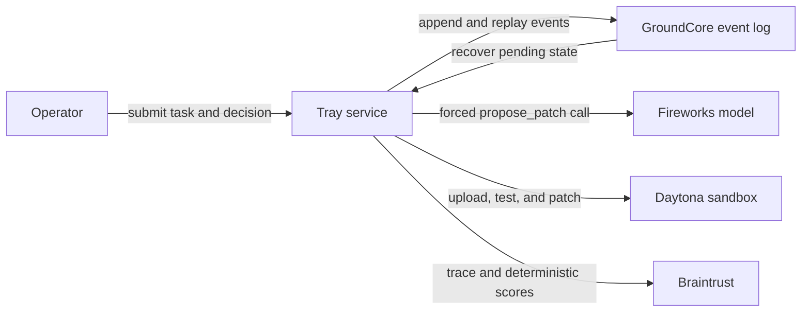

# Tray

Tray is a durable approval and recovery service for AI-generated code changes. Fireworks proposes a typed patch, a person approves it, Daytona executes it, Braintrust evaluates it, and GroundCore records every workflow transition.

## Problem

An AI coding workflow can lose a pending operation when its controller restarts. If the proposed change, approval state, or execution result exists only in process memory, the workflow cannot reliably resume and its actions cannot be audited afterward.

Tray persists each transition before moving to the next action. A proposed change contains the complete executable operation, including the old and new file contents. Approval and execution use the persisted proposal instead of requesting another model response.

## Architecture



## Development

Copy `.env.example` to `.env`, add the required API keys, and install dependencies:

```sh
cp .env.example .env
npm install
```

Run the foundation and Daytona integration checks:

```sh
npm run typecheck
npm run smoke:eventlog
npm run smoke:daytona
```

## Disclosure

GroundCore (the append-only event store, vendored as a prebuilt `groundhog` binary) is a pre-existing personal project. Everything else — the Tray service, Daytona execution, approval flow, UI, and Braintrust integration — was built during Daytona HackSprint SF, July 24, 2026.
